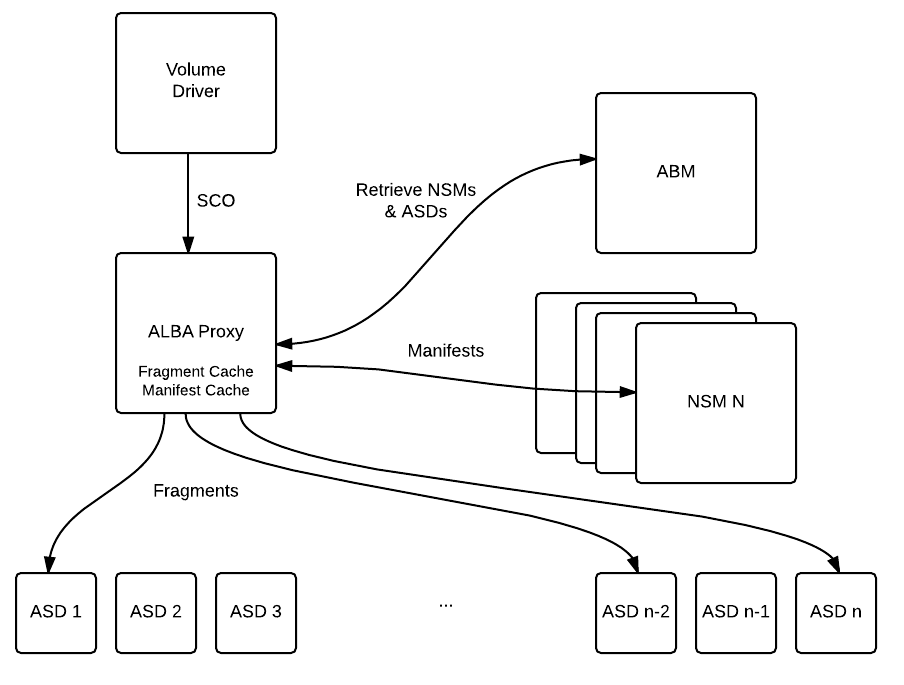

# ALBA
ALBA(ALternative BAckend) is a distributed object store, like Swift, Ceph and Amplistor. ALBA is highly optimised for Open vStorage as it is optimized to store Volume Drives SCOs. It aggregates a set of OSDs like Alba's ASDs or Seagate's Kinetic Drives into a pool of storage that you can use as a storage backend for Open vStorage.

Alba supports the following high-end set of features:

* erasure coding
* replication
* (optional) compression
* (optional) encryption
* partial reads
* namespaces
* repair
* rebalancing
* flash acceleration
* global and local recovery
* ...

Unlike most alternatives, ALBA is a consistent store. Since it is optimised for the types of objects Open vStorage's volume driver needs to store and retrieve, Alba has become the default object storage backend for Open vStorage.

## Architecture

### ALBA Proxy
ALBA currently run a proxy service on the same host as the Volume Driver.

Using proxy has some advantages:
* We can easily add more protocols to the backend (Swift, S3, ... ) without having to change the Volume Driver. On top we can add functionality to Object Storage solutions they don't offer out of the box (f.e. partial object retrieval, compression, encryption).
* Each proxy has a local, on disk fragment cache. When fragments are retrieved from the OSDs they are normally added to this cache. Further (partial) reads might need them too. The fragments are in packed state (possibly compressed and encrypted). The cache currently uses a simple LRU victim selection algorithm.

More info on the ALBA proxy can be found in [this section](albaproxy.md).

### ALBA Manager
An ALBA Manager (ABM) is an Arakoon cluster running with the albamgr plugin. It’s the entry point for all clients. It knows which disks belong to this alba instance. It knows which namespaces exist and on which nsm hosts they can be found.

### NSM Host
A Name Space Manager (NSM) host is an Arakoon cluster running with the nsm_host plugin. It is registered with the alba manager and can host namespace managers.

### Namespace Manager
The namespace manager is the remote API offered by the NSM host to manipulate most of the object metadata during normal operation. Its coordinates can be retrieved from the ALBA Manager by (proxy) clients and maintenance agents.

## Backends, OSDs, ASDs and Seagate Kinetic drives
ALBA supports 3 types of devices: ALBA backends, Seagate Kinetic drives and ASDs. The Seagate Kinetic drives are ethernet-connected HDD with an open source object API designed specifically for hyperscale and scale-out environments. An ASD (ALBA Storage Daemon) is a our own pure software based implementation of the same concept on top of normal SATA disks: a Socket Server on top of RocksDb, offering persistence for meta data and small values, while large values reside on the file system. Every atomic multi-update is synced before the acknowledgement is returned. To have acceptable performance updates for multiple clients are written to the disk in batches. This is effectively a trade-off, increasing latency for throughput, which is perfectly acceptable for our use case (writes by the VM are already acknowledged when they hit the write buffer). Note that multiple ASD processes can run on a single disk.

ASD’s follow the same strategy as the Kinetic drives, advertising themselves via a UDP multicast of a json config file. A single parser can be used to retrieve connection information for ASD and Kinetic drive alike.

OSDs (Object Storage Daemon) are generic abstraction over ASDs and Seagate Kinetic drives.

## Fragments & Objects
Alba stores objects, grouped per namespace. These objects are divided into chunks which are encoded into fragments. The fragments are stored onto OSDs under a key.
A manifest for the object is stored in the corresponding NSM. The manifest contains (amongst other things) the locations of all fragments
that compose this object.

ALBA divides the object in chunks to ensure data safety. By Spreading the fragments across multiple OSDs, a drive or even node failure can be survived. Objects should be dispersed with over disks with a certain number (k) data fragments, a certain number (m) of parity fragments, and a limit (x) on the number of disks from the same node that can be used for a specific object. An upload can be successful, even when not all (k + m) fragments are stored. There’s a minimum number of fragments (c), with (k ≤ c ≤ k + m) that needs to have been stored, before an upload can be considered successful. The tuple (k, m, c, x) describes a **policy**.
Objects can also be encrypted or compressed. The combination of one or more policies, the type of compression and the encryption key is a **preset**.

## ALBA Config files
The ALBA configuration file is located at `/opt/OpenvStorage/config/alba.json`. For the maintenance process the node specific config file is located at `/opt/OpenvStorage/config/arakoon/<backend_name>-abm/<backend_name>.json`.
For the rebalancer the node specific config file is located at `/opt/OpenvStorage/config/arakoon/<backend_name>-abm/<backend_name>-rebalancer.json`. More info on the ALBA config files can be found [here](../../Administration/Configs/alba.md)

## ALBA Log files
The log files for the ALBA maintenance process and the rebalancer can be found under `/var/log/upstart/ovs-alba-maintenance_<backend_name>.log` and `/var/log/upstart/ovs-alba-rebalancer_<backend_name>.log`.
